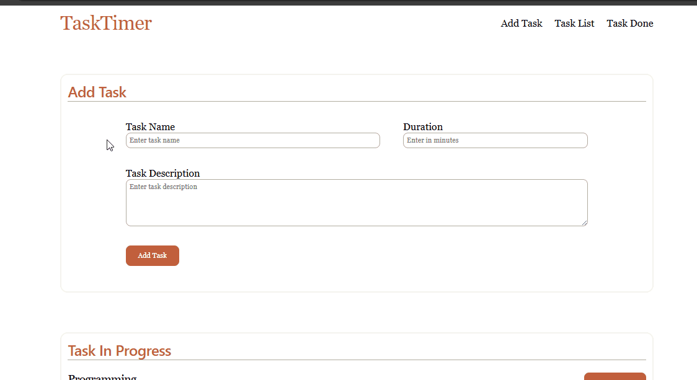

# ⏲ TaskTimer

TaskTimer is a brower based app that allows the user to add and set specific minutes for each task. This also includes task title and description. Task will only be mark done after the finishing the timer. 

## 💻 Demo

 

[Live Demo](https://cedrexpelagio.github.io/TaskTimer/) ← Click the link to monitor your task

## 📦 Technologies
- HTML
- CSS
- JavaScript

## 🚀 Features
1. Add task with title, description and set specific timer in minutes
2. Automatically add date on added task
3. Timer for each task after clicking the start button
4. Task can be deleted  
5. Automatically mark task done after the timer

## 🤳 How to Use
1. Add task by filling up the add task form
2. Add task title, description and duration in minute
3. Click add to add the task in the list
4. Click start to start the timer or click delete to delete the task immediately
5. Wait for the timer to finish
- You can pause and resume the task timer
- Even you close timer pop up, the timer will still continue to run
6. Once done, the task will be mark as done
7. Click done to permanently remove the task from the list
8. Check task done list for the task that are done
9. Congratualitions you accomplish a task

## 👨‍💻 Run Locally

1. Clone the repository
```bash
   git clone https://github.com/cedrexpelagio/TaskTimer.git
```
2. Navigate to the project folder
```bash
   cd TaskTimer
```
3. Open `index.html` in your browser (double-click it, or right-click → Open With → your browser)

## 🔮 Future Improvements
- Persistent storage – save tasks with localStorage so they survive a page refresh
- Edit task – allow editing title, description, or duration after a task is added
- Sound/browser notification – alert the user when a timer finishes, even if the tab isn't active
- Progress bar / visual countdown – show a circular or linear progress indicator, not just numbers
- Search/filter/sort – by date, duration, or status
- Drag-and-drop reordering – let users rearrange tasks in the list

## ⚙ Process
I started by brainstorming the branding for my simple system. The theme is inspired by Claude's UI design, from font to color. Next, I structured it in HTML and CSS. For this project, I started with the mobile screen size.

Then, I added the JavaScript logic. First, I created simple add and delete functionality. Next, I researched how to add a timer feature to my project. This was the most challenging part of my journey — I had to consult AI chatbots to understand the logic. I also structured and styled the timer popup. Lastly, I added media queries for tablet and laptop screen sizes. 

## 📝 Learning

In this project, I learned a lot about responsive UI design and JavaScript logic. In CSS, I learned how to work with a mobile-first approach, which helped me style for tablet and laptop screens. Then, in JavaScript, I improved my knowledge of DOM manipulation and events, since I had already experimented with these concepts in my [Rock-Paper-Scissors](https://github.com/cedrexpelagio/Rock-Paper-Scissors/) website. I also learned how to use the `setInterval` function to create a timer. This project taught me how to use my current knowledge of CSS and JavaScript to build a functioning, responsive website.
